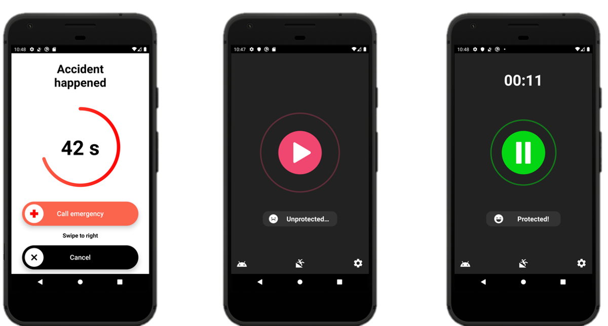

# **AccWise: Fall Detector - Android App**

 

AccWise: Fall Detector is an Android application designed to detect falls using accelerometer data. With a single button press, users can activate a background service that monitors their activity. If a fall is detected, an alarm is triggered to alert nearby individuals. Users or first responders can then use the phone to contact emergency services directly. Additionally, if no response is received, the app will send an SMS and email with the user's location to emergency contacts.

## About Implementation

AccWise: Fall Detector utilizes selected mathematical features derived from accelerometer data during a fall event. These features are fed into a machine learning model trained on simulated events to determine the likelihood of a fall occurrence. The model achieved an accuracy of 90.5%, with a precision of 78% and recall of 90.5% for fall detection.

For more in-depth information, datasets, and research on this topic, visit the [AccWise: Fall Detector Research Repository](https://github.com/Foxpace/AccWise_research).

## Technical Implementation

The project consists of two main iterations: initially using a feedforward neural network and later transitioning to a random forest model. This change improved the accuracy from 86% to 90.5%. The primary implementation is in Java, with some components written in Kotlin and C++.

### Java Implementation

The fall detection is managed by a background service named **DetectionService**. It consists of two main objects: **BatteryOptimizer** and **ModelManager**.

**BatteryOptimizer** controls the life cycle of the **ModelManager**, ensuring efficient power management and sensor utilization.

**ModelManager** oversees all technical requirements for fall detection, managing sensor data, GPS handling, and instantiating the appropriate detector based on requirements.

**DetectorFall** is responsible for processing sensor samples and interfacing with the machine learning model for decision-making.

### Fall Detection Algorithm

1. Detect initial acceleration above 3g.
2. Wait for 750ms (BUFFER).
3. Monitor for subsequent 3g values; restart if detected.
4. If no further 3g values, evaluate the last 10 seconds.
5. Analyze average post-event activity. If below 10.25 m/s^2, pass to the ML model.
6. If values remain below 2 m/s^2, it indicates a potential free fall (unless "active in pocket" option is used).
7. Features are calculated, model decision is made, and an alarm is triggered if necessary.

### C++ Implementation

The C++ version uses a neural network and interfaces with the Java components via JNI. It uses a state model to manage the detection process, with states like FILLING, WAITING, BUFFER, and HIGH_ACTIVITY.

## Car Accident Detection

The project also explored car accident detection based on accelerometer data. By analyzing patterns, such as abrupt changes in speed or variance in acceleration, potential collisions can be identified. However, this feature is not included in the app but offers insights into future developments.

## Limitations

Despite the app's capabilities, it faces challenges due to battery optimization policies imposed by phone manufacturers. These policies can interfere with the app's background operation, affecting its reliability. Users are encouraged to refer to resources like [dontkillmyapp.com](https://dontkillmyapp.com/) for potential workarounds.

## Disclaimer

AccWise: Fall Detector is a prototype app, and its reliability is not guaranteed. Users use the app at their own risk, and the developer is not liable for any consequences arising from its use.

## Acknowledgments and Libraries

## Several open-source libraries were instrumental in the development of AccWise, including:
- [AppIntro](https://github.com/AppIntro/AppIntro)
- [CountryCodePickerProject](https://github.com/hbb20/CountryCodePickerProject)
- [LicensesDialog](https://github.com/PSDev/LicensesDialog)